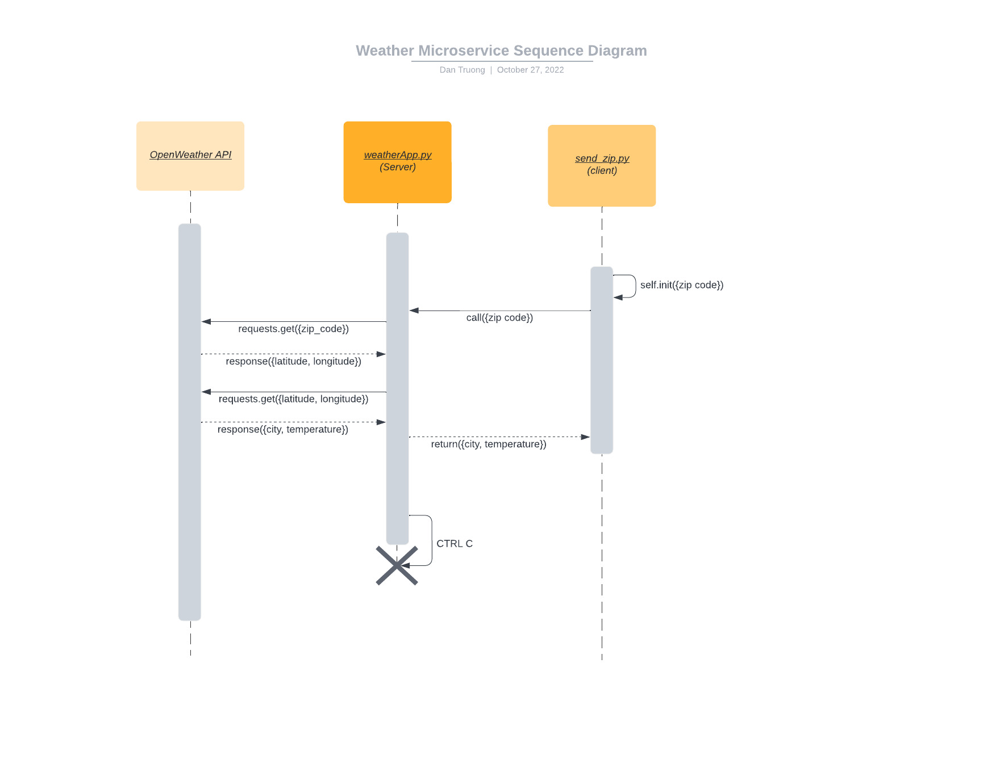

Instructions for Weather Microservice

1. Start weatherApp.py in your console to run the server.
    python weatherApp.py
2. Move send_zip.py to base folder of your python code and import send_zip.py module.
    import send_zip.py
3. Make calls to the server by creating SendZipClient({ZIPCODE}) objects, adding in zip code.
The response will be in JSON format which contains both the name of the city and the temperature.
To access those values, use the corresponding keys:
    For city name, use ['name']
    For temperature, use ['main']['temp']

--------Your code should look like this:----------
    rpc = SendZipClient('{ZIPCODE}')
    response = rpc.call()
    city = response['name']
    temperature = response['main]['temp']

If you want to access other values from the response, see below for an example of what
the weather response looks like.
 {   'coord': {'lon': -122.3612, 'lat': 47.3104}, 
     'weather': [{'id': 804, 'main': 'Clouds', 'description': 'overcast clouds', 'icon': '04d'}], 
     'base': 'stations', 
     'main': {'temp': 42.98, 'feels_like': 39.47, 'temp_min': 39.47, 'temp_max': 46.78, 'pressure': 1020, 'humidity': 92}, 
     'visibility': 10000, 
     'wind': {'speed': 5.75, 'deg': 170}, 
     'clouds': {'all': 100}, 
     'dt': 1666540663, 
     'sys': {'type': 2, 'id': 2012396, 'country': 'US', 'sunrise': 1666535967, 'sunset': 1666573664}, 
     'timezone': -25200, 
     'id': 5794245, 
     'name': 'Federal Way', 
     'cod': 200
     }

